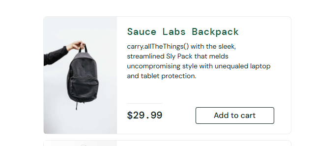
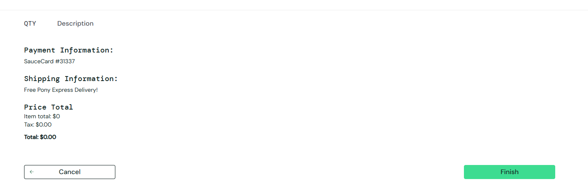
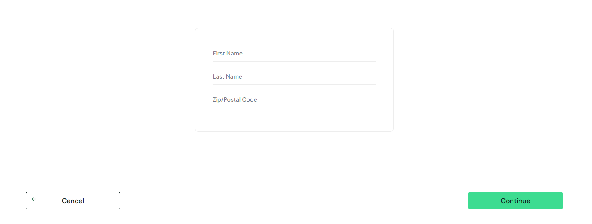
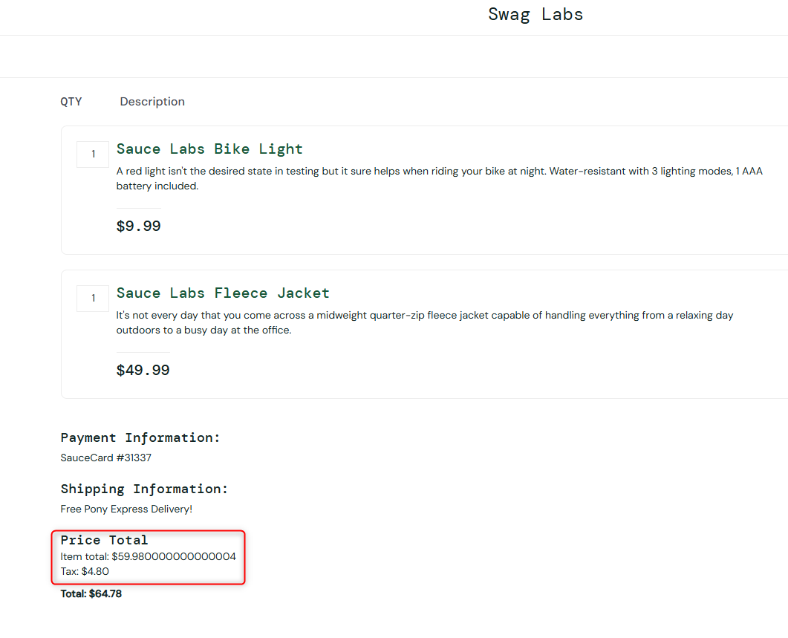
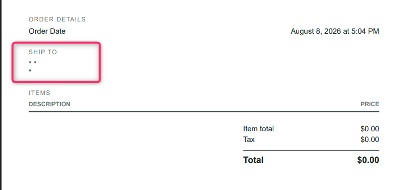

# BUGS

## Exploratory session strategy

Given the limited time frame, I prioritized the most business-critical and most probable user flows:

- used CRUD, state transition and consistency heuristics, focusing on how data and application state change across login → cart → checkout → order confirmation flow.
- prioritized the most probable user flows, such as successful login, browsing products, adding/removing items anywhere from the website, reviewing the cart, and completing checkout.
- applied boundary/error tours to explore empty cart, invalid inputs, interrupted flows, and repeated actions, because these areas are most likely to reveal issues during user interactions.
- deliberately selected a normal user and tested the application in its healthy state rather than using users known to produce errors as the end goal was to determine whether defects could be found during normal user behavior.

## BUG #1

**Title:** User cannot buy multiple items of the same kind

**Environment:** Windows, Chrome

**Steps to reproduce:**

1. Login with standard_user / secret_sauce
2. Try to buy multiple items of the same kind

**Expected:** User can buy more than 1 item at a time

**Actual:** User can buy only 1 item at a time

**Severity:** S2 (Does not produce any errors, user is not blocked and purchase can be completed)

**Priority:** P1 (Affects user experience)

**Attachment:**

## BUG #2

**Title:** User should not be able to checkout an empty cart

**Environment:** Windows, Chrome

**Steps to reproduce:**

1. Login with standard_user / secret_sauce
2. Proceed to cart and checkout with no products added

**Expected:** User should not be able to checkout an empty cart

**Actual:** Checkout with empty cart is not forbidden

**Severity:** S3 (Does not produce any errors)

**Priority:** P2 (Affects system performance, system can be polluted with empty orders)

**Attachment:**

## BUG #3

**Title:** Payment method, credit card selection is missing on Checkout

**Environment:** Windows, Chrome

**Steps to reproduce:**

1. Login with standard_user / secret_sauce
2. Add some items to the cart
3. Proceed to checkout, personal data

**Expected:** User should not be able to select payment method/credit card

**Actual:** Payment method, credit card selection is missing

**Severity:** S1 (Product can be bought for free)

**Priority:** P1 (Product can be bought for free)

**Attachment:**

## BUG #4

**Title:** Tax calculation should be explained

**Environment:** Windows, Chrome

**Steps to reproduce:**

1. Login with standard_user / secret_sauce
2. Add some items to the cart
3. Proceed to checkout
4. Observe Tax amount

**Expected:** User should have an explanation of how Tax is calculated

**Actual:** User have no idea how Tax is calculated

**Severity:** S1 (Affects user's money, info should be transparent)

**Priority:** P1 (Affects user's money, info should be transparent)

**Attachment:**

## BUG #5

**Title:** Fix Total calculation affected by JS float numbers

**Environment:** Windows, Chrome

**Steps to reproduce:**

1. Login with standard_user / secret_sauce
2. Add 2 items in the cart, where price end with .99: (Sauce Labs Bike Light = 9.99) and (Sauce Labs Fleece Jacket = 49.99)
3. Proceed to checkout
4. Observe Item total

**Expected:** $59.980000000000004

**Actual:** $59.98

**Severity:** S2 (Affects user's money)

**Priority:** P2 (Affects user's money)

**Attachment:**

## BUG #6

**Title:** Checkout personal data allows invalid characters

**Environment:** Windows, Chrome

**Steps to reproduce:**

1. Login with standard_user / secret_sauce
2. Proceed to checkout
3. Try invalid characters in every field: First Name, Last Name, Zip Code: !@#$%^&(),.\*` whitespace, blank or numbers for Names

**Expected:** Characters should be forbidden

**Actual:** Characters allowed

**Severity:** S2 (Purchase can be submitted for anyone)

**Priority:** P1 (Purchase can be submitted for anyone)

**Attachment:**

